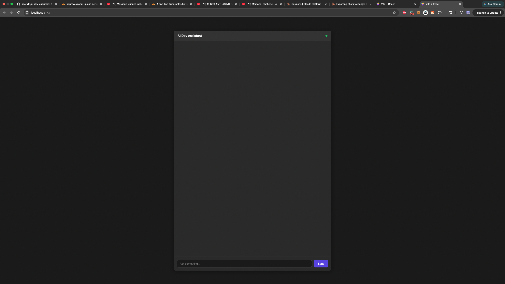
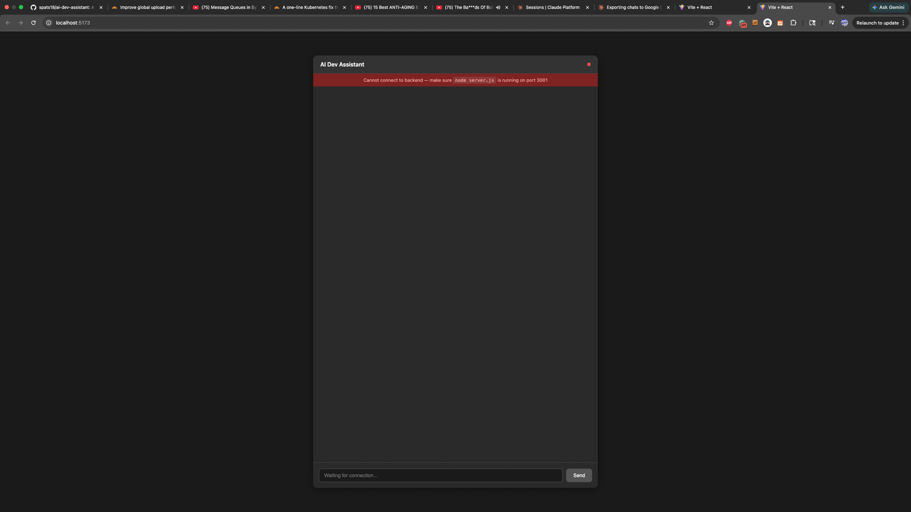

# AI Dev Assistant

A personal AI coding assistant with a React frontend, Node.js backend, and a locally hosted LLM via Ollama. No cloud costs, no API keys — runs entirely on your machine.

## Screenshots

**Chat UI — connected and ready**


**Error state — backend not running**


## Stack

- **Frontend:** React (Vite)
- **Backend:** Node.js + Express + WebSocket (socket.io)
- **LLM:** Ollama running locally
- **Model:** `qwen2.5-coder:7b`

## How It Works

```
React (5173)  →  WebSocket  →  Node.js (3001)  →  Ollama (11434)
                                                        ↓
React         ←  tokens     ←  Node.js          ←  streams response
```

1. User types a message in the React chat UI
2. Message is sent over WebSocket to the Node.js backend
3. Backend forwards it to Ollama at `localhost:11434`
4. Ollama streams tokens back one by one
5. Backend pipes each token over WebSocket to React in real time

## Getting Started

### Prerequisites
- [Node.js](https://nodejs.org)
- [Ollama](https://ollama.com) installed and running

### 1. Pull the model
```bash
ollama pull qwen2.5-coder:7b
```

### 2. Start Ollama
```bash
ollama serve
```

### 3. Start the backend
```bash
npm install
node server.js
```

Backend runs on `http://localhost:3001`

### 4. Start the frontend
```bash
cd frontend
npm install
npm run dev
```

Frontend runs on `http://localhost:5173`

## Project Status

- [x] Phase 1 — Backend: Ollama streaming over WebSocket
- [x] Phase 1 — Frontend: React chat UI with real-time streaming
- [x] Phase 1 — Frontend: Connection error handling (banner + status indicator)
